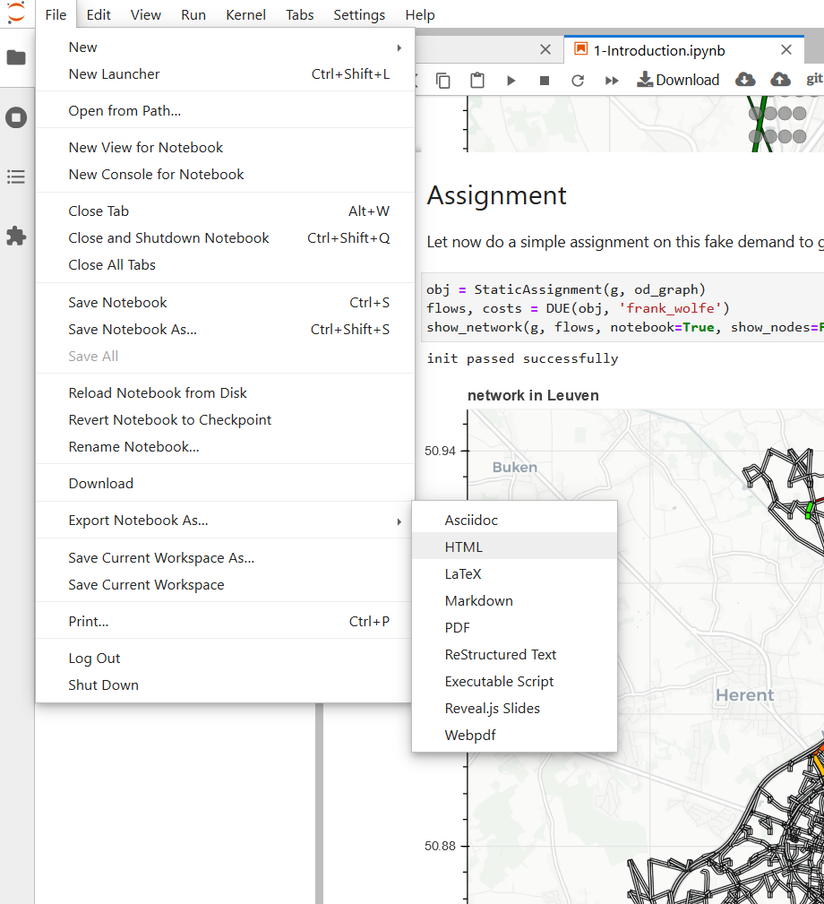

We'll be doing the Introduction and Assignment sessions today. To follow along with the notebooks click on the Binder button below.
Binder runs in the Google Cloud on non-persistent compute instances. For you this means you need to 
**save your progress as .html before closing the browser**
and submit this to us at the end of the session. 
Submission is handled via Toledo, we'll post an assignment after the session has started.

# How to save a notebook as .html file
